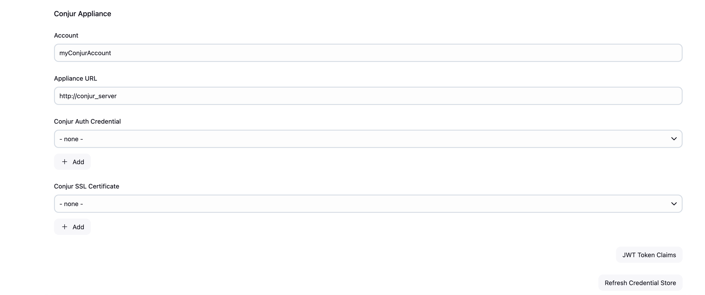
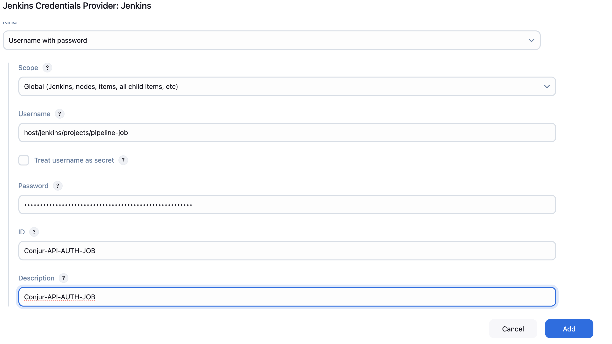
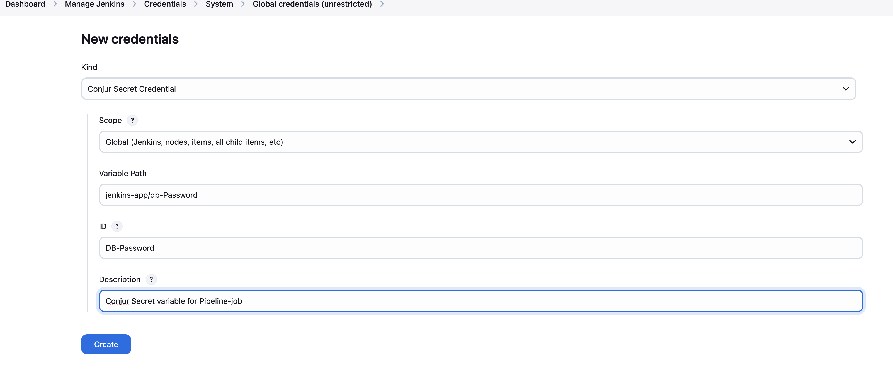

# Conjur-OSS-Setup

This Conjur plugin securely provides credentials that are stored in Conjur to Jenkins jobs.

## Step-by-Step Guide

### Set up a Conjur Open Source Environment

Refer to the [Official Conjur OSS Quick Start Guide](https://www.conjur.org/get-started/quick-start/oss-environment/).

### Docker Compose Configuration

#### Add Jenkins

```yaml
jenkins_server:
  image: jenkins/jenkins:2.401.3
  container_name: jenkins_server
  build:
    context: .
    dockerfile: Dockerfile
  ports:
    - 8088:8080
  volumes:
    - ./jenkins_custom_volume:/var/jenkins_home
  environment:
    - JAVA_HOME=/usr/lib/jvm/java-17-openjdk-amd64
    - PATH=/usr/lib/jvm/java-17-openjdk-amd64/bin:$PATH
  restart: on-failure
```

#### Add CloudBees

```yaml
cloudbees:
  image: cloudbees/cloudbees-core-mm:2.426.2.2
  container_name: cloudbees
  ports:
    - 8085:8080
  restart: on-failure
  volumes:
    - ./cloudbees:/var/jenkins_home
```

## Conjur Configuration Using API-Key

### Define the Policy (`jenkins-host-api.yml`)

```yaml
- !policy 
  - !host
    id: jenkins-app
  - &variables
    - !variable dbUserName
    - !variable dbPassword
    - !variable dbUrl
```

### Load the Policy

```bash
conjur policy load -f jenkins-host-api.yml -b root
```

### Set Secret Variable Values

```bash
conjur variable set -i jenkins-app/dbUserName -v "JENKINS"
conjur variable set -i jenkins-app/dbPassword -v "Password"
conjur variable set -i jenkins-app/dbUrl -v "http://google.com"
```

## Conjur Configuration Using JWT Authentication

### Define JWT Authentication Policy (`authn-jwt-jenkins.yml`)

```
- !policy
   id: conjur/authn-jwt/jenkins
   annotations:
    description: JWT Authenticator web service for Jenkins
    jenkins: true
   body:
    # Create the conjur/authn-jwt/jenkins web service
    - !webservice

    # Optional: Uncomment any or all of the following variables:
    # * token-app-propery
    # * identity-path
    # * issuer
    # identity-path is always used together with token-app-property
    # however, token-app-property can be used without identity-path

    - !variable
      id: token-app-property
      annotations:
        description: JWT Authenticator bases authentication on claims from the JWT. You can base authentication on identifying clams such as the name, the user, and so on. If you can customize the JWT, you can create a custom claim and base authentication on this claim.

    - !variable
      id: identity-path
      annotations:
        description: JWT Authenticator bases authentication on a combination of the claim in the token-app-property and the full path of the application identity (host) in Conjur. This variable is optional, and is used in conjunction with token-app-property. It has no purpose when standing alone.

    - !variable
      id: issuer
      annotations:
        description: JWT Authenticator bases authentication on the JWT issuer. This variable is optional, and is relevant only if there is an iss claim in the JWT. The issuer variable and iss claim values must match.
    
    - !variable
      id: audience
      annotations:
        description: JWT Authenticator validates the audience (aud) in the JWT.

    # Mandatory: The JWT Provider URI: You must provide either a provider-uri or jwks-uri

    # - !variable
    #   id: provider-uri
    #   annotations:
    #     description: The JWT provider URI. Relevant only for JWT providers that support the Open ID Connect (OIDC) protocol.

    - !variable
      id: jwks-uri
     # id: public-keys
      annotations:
        description: A JSON Web Key Set (JWKS) URI. If the JWKS vendor provides both a jwks-uri and an equivalent provider-uri, you can use the provider-uri which has an easier interface to work with.

    # Group of hosts that can authenticate using this JWT Authenticator
    - !group
      id: consumers
      annotations:
        description: Allows authentication through authn-jwt/jenkins web service.
        editable: "true"
    
    # Permit the consumers group to authenticate to the authn-jwt/jenkins web service
    - !permit
      role: !group consumers
      privilege: [ read, authenticate ]
      resource: !webservice

    # Create a web service for checking authn-jwt/jenkins status
    - !webservice
      id: status

    # Group of users who can check the status of authn-jwt/jenkins
    - !group
      id: operators
      annotations:
        description: Group of users that can check the status of the authn-jwt/jenkins authenticator.
        editable: "true"
    
    # Permit group to check the status of authn-jwt/jenkins
    - !permit
      role: !group operators
      privilege: read
      resource: !webservice status
```


## Load JWT Authentication Policy

```bash
 $ docker compose exec client conjur policy load -b root -f policy/authn-jwt-jenkins.yml
```
## Set the variables values of authn-jwt policy file
   1.  In case of Jenkins
         ```bash
         $ docker compose exec client conjur variable set -i conjur/authn-jwt/jenkins/jwks-uri -v 'http://jenkins_server:8080/jwtauth/conjur-jwk-set'
         $ docker compose exec client conjur variable set -i conjur/authn-jwt/jenkins/issuer -v 'http://localhost:8083'
         ```
   2.  In case of CloudBees

         ```bash
         $ docker compose exec client conjur variable set -i conjur/authn-jwt/jenkins/jwks-uri -v 'http://cloudbees:8080/jwtauth/conjur-jwk-set'
         $ docker compose exec client conjur variable set -i conjur/authn-jwt/jenkins/issuer -v 'http://localhost:8091'
         ```
   3. Common for Both
         ```bash
            $ docker compose exec client conjur variable set -i conjur/authn-jwt/jenkins/audience  -v 'cyberark-conjur'
            $ docker compose exec client conjur variable set -i conjur/authn-jwt/jenkins/token-app-property -v 'jenkins_name'
            $ docker compose exec client conjur variable set -i conjur/authn-jwt/jenkins/identity-path -v 'jenkins/projects'
         ```
## Define the hosts and also secrets and set the values to those secret variables
   1. Define hosts in policy name it as jenkins-projects.yml

      ```yaml
         - !policy
           id: jenkins
           body:
              - !policy
                id: projects
                annotations:
                   description: Projects that do not fall under a folder within Jenkins or project-specific host identities for authn-jwt/jenkins authentication.
                   jenkins: true
                body:
                    - !host
                      id: pipeline-job
                      annotations:
                          jenkins: true
                          authn-jwt/jenkins/jenkins_pronoun: Pipeline
                          authn-jwt/jenkins/jenkins_full_name: pipeline-job
                    - !grant
                       role: !group
                       members:
                          - !host pipeline-job
          - !grant
             role: !group conjur/authn-jwt/jenkins/consumers
             member: !group jenkins/projects
      ```
 2. Load the policy file of hosts defined
    ```bash
       $ docker compose exec client conjur policy load -b root -f policy/jenkins-projects.yml
    ```
3. Define the secrets and name it as jenkins-secrets.yml
   ```yaml
        - &simple-pipeline-secrets
             - !variable pipeline-credential-1
             - !variable pipeline-credential-2

        - !permit
          resources: *simple-pipeline-secrets
          privileges: [read, execute]
          roles: !host jenkins/projects/pipeline-job
   ```
4. Set the value to those secrets

      ```bash
         $ docker compose exec client conjur variable set -i pipeline-credential-1  -v "This-has-secret-value"
         $ docker compose exec client conjur variable set -i pipeline-credential-2  -v "This-has-secret-value-2"
      ```
## Global Configuration in Jenkins
###  Global Configuration: Conjur Appliance
       
1. By providing Conjur appliance URL and Conjur Account.

2. In case of API Authentication (not in case of JWT authentication):
   - Provide API Auth Credential
3. Provide SSH Certificate
   

      
### Global Configuration: Conjur JWT Authentication
#### In Case of JWT Authentication

Please read the documentation for the [JWT Authenticator](https://docs.cyberark.com/conjur-enterprise/latest/en/content/operations/services/cjr-authn-jwt.htm?tocpath=Integrations%7CJWT%20Authenticator%7C_____0).

You can enable the use of JWT Authentication by checking **"Enable JWT Key Set Endpoint"**. This will allow the plugin to provide an endpoint for the `JWKS_URI` (described in the documentation link).

The **JWT Key Set Endpoint** will be: BASEURLFORJENKINS/jwtauth/conjur-jwk-set

Once enabled, any job that runs from Jenkins where a Conjur Login Credential has **not** been provided, the `conjur-credentials` plugin will automatically generate a **JWT Token** based on the context of the execution, which can be used as an authentication mechanism.

The token signature will be validated with the **JWT Key Set** exposed by the endpoint.


#### You also need to define the following:

- Auth WebService ID  :
  The Service ID of your JWT Authenticator webservice.  
  This could be either the `service-id` or `authenticator_type/service_id` (e.g., `authn-jwt/my-service-id`).

- JWT Audience  :
  The `aud` value in the JWT Token.

- Signing Key Lifetime (in Minutes) :
  Defines how long the signing key for JWT Tokens will be valid and exposed via the JWT Key Set endpoint.

- JWT Token Duration (in Seconds) :
  Lifetime of any JWT token generated via the `conjur-credentials` plugin.

- Identity Format Fields :
  Comma-separated list of JWT Claim fields to be concatenated for the value of the Identity Field.

- Enable Context Aware Credential Stores  :
  Please see the following section for more details.
#### How to obtain JWT Token Claims
In the configuration page of the item (project, job, foler, etc) you will find the "JWT Token Claims" button, clicking on it will show the JWT Token claims for the  item based on the context where it is

#### Global Configuration: Context Aware Credential Stores (Conjur Credentials Provider)

When Context Aware Credential Stores is enabled, the conjur-credentials plugin will act as a Credential Provider and populate stores with the available secrets/variables based on the current context of the navigation. For this feature, JWT Authentication is used and the JWT Key Set Endpoint needs to be enabled. The credentials provided by the context aware store are available to be used as if they were defined statically.


## 🔐 Secret Retrieval in Jenkins with Conjur


### 🔑 In Case of API Authentication

#### 1. Conjur Auth Credential

The first step is to store the credentials required for Jenkins to connect to Conjur.  
Go to the **Credentials** tab and define the credential as a standard **"Username with password"** credential.

- **Username**: `host/jenkins/projects/pipeline-job`  
  > The host must already be defined in your Conjur policy.

- **Password**: The **API key** for that host.  
  > This API key is returned by Conjur when the host is loaded in policy.



---

#### 2. Conjur Secret Definition (Static)

The secrets you want to retrieve from Conjur must be defined explicitly under the **ConjurSecret** tab.

Define them as credentials of kind:

- `Conjur Secret Credential`
- `Conjur Secret Username Credential`
- `Conjur Secret Username SSHKey Credential`

📌 **Example: Conjur Secret Credential**

- **Variable Path**: `jenkins-app/db-Password`  
- **ID**: `DB_PASSWORD`  
- **Description**: `Conjur Secret variable for Pipeline-job`

  


---

#### 3. Usage from a Jenkins Pipeline Script

Use `withCredentials` and the symbol:

- `conjurSecretCredential`
- `conjurSecretUsername`
- `conjurSecretUsernameSSHKey`

##### 📌 Example 1: Conjur Secret Credential

```groovy
node {
    stage('Work') {
        withCredentials([conjurSecretCredential(credentialsId: 'DB_PASSWORD', variable: 'SECRET')]) {
            echo 'Hello World $SECRET'
        }
    }
    stage('Results') {
        echo 'Finished!'
    }
}
```
##### 📌 Example 2: Conjur Secret Username SSHKey Credential

```groovy
node {
    stage('Work') {
        withCredentials([conjurSecretUsernameSSHKey(
            credentialsId: 'username-conjur-authn-api-test-database-password', 
            usernameVariable: 'USERNAME', 
            secretVariable: 'SECRET')]) {
            echo 'Hello World $USERNAME $SECRET'
        }
    }
    stage('Results') {
        echo 'Finished!'
    }
}
```

##### 📌 Example 3: Conjur Secret Username Credential

```groovy
node {
    stage('Work') {
        withCredentials([conjurSecretUsername(
            credentialsId: 'username-conjur-authn-api-test-database-password', 
            usernameVariable: 'USERNAME', 
            passwordVariable: 'SECRET')]) {
            echo 'Hello World $USERNAME $SECRET'
        }
    }
    stage('Results') {
        echo 'Finished!'
    }
}
```

---
#### 4. Usage from a Jenkins Freestyle Project
For Freestyle projects:

 - Go to Build Environment section.

 - Check "Use secret text(s) or file(s)".

 -  The secrets will be injected as environment variables to the build steps.


### In case of JWT authentication
#### 1. Policy Annotations for Context Aware Credential Store

To enable automatic secret retrieval using JWT Authentication in Jenkins, you can annotate your **Conjur policy**. 

These annotations allow the Jenkins Conjur plugin to expose **Conjur Secret Credential** entries based on the context.

📌 **Example Host Definition with Annotations:**

```yaml
- !host
  id: pipeline-job
  annotations:
    jenkins: true
    authn-jwt/jenkins/jenkins_pronoun: Pipeline
    authn-jwt/jenkins/jenkins_full_name: pipeline-job
```

- Any secret variable in Conjur associated with the host (as shown above) will be exposed in Jenkins.

- These secrets will appear in the Credentials Store as type Conjur Secret Credential.
  
#### 2. Usage from a Jenkins Pipeline Script
You can retrieve the exposed Conjur secrets in your Jenkins Pipeline using withCredentials and the conjurSecretCredential symbol.
##### 📌 Example 1: Conjur Secret Credential

```groovy
node {
    stage('Work') {
        withCredentials([conjurSecretCredential(credentialsId: 'pipeline-credential-1', variable: 'SECRET')]) {
            echo 'Hello World $SECRET'
        }
    }
    stage('Results') {
        echo 'Finished!'
    }
}
```
